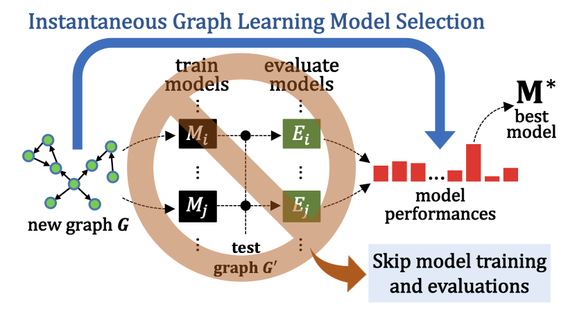
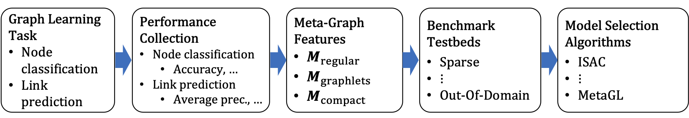

## Overview
This repository contains code and data of the GLEMOS benchmark to develop and evaluate algorithms for instantaneous selection of graph learning (GL) models.
<div align="center">

</div>
This repository provides a comprehensive benchmark environment, covering the steps required to achieve effective instantaneous GL model selection, 
with multiple options available for the major building blocks of GL model selection, as depicted below.
<div align="center">

</div>

For a detailed description of the GLEMOS benchmark and its components, please refer to [our paper](https://openreview.net/pdf?id=5HisVXnx0n).

Below we provide details on 
[package installation](#installation), 
[data files](#data-files), 
[GL model performance collections](#graph-learning-gl-model-performance-collection), 
[meta-graph features](#meta-graph-features), 
[model selection algorithms and testbeds](#evaluating-model-selection-algorithms), as well as
information on 
[citation](#citation), 
[license](#license), and 
[how to contribute to the project](#contributing).  


## Installation
Running [install_packages.sh](install/install_packages.sh) sets up the conda environment and installs required packages.


## Data Files
Data files are organized into the following subdirectories in the [data](data) directory.  
- [metafeats](data/metafeats) contains multiple types of meta-graph features 
    (e.g., M<sub>regular</sub> and M<sub>compact</sub>) generated for each graph.
- [testbeds](data/testbeds) contains data splitting for training and evaluating model selection algorithms 
    (e.g., splitting over the performance matrix and meta-graph features).
- [workspace](data/workspace) contains a pickle file, 
    which includes performance matrices of the two GL tasks obtained with different performance metrics,
    different sets of meta-graph features, as well as the list of GL models, and the name and domain of graphs.
- [link-pred-perfs](data/link-pred-perfs)
    contains the link prediction performances evaluated on all graphs.
    'perf_dict.json' file in each directory provides the model performances on the corresponding graph, measured by
    multiple applicable metrics (e.g., roc auc and average precision).
    Due to the large size of the data, the files in this folder can be downloaded from [this link](https://www.dropbox.com/scl/fo/bfdk3pc43csn9916hqcgc/h?rlkey=x6gifhn1fc9hltak8bydmoffc&dl=0).
    Note that the [workspace](data/workspace) folder provides preprocessed performance records measured in a few selected metrics.
- [node-class-perfs](data/node-class-perfs)
    contains the node classification performances evaluated on a subset of graphs with node labels.
    'perf_dict.json' file in each directory provides the model performances on the corresponding graph, measured by
    multiple applicable metrics (e.g., accuracy and average precision).
    Due to the large size of the data, the files in this folder can be downloaded from [this link](https://www.dropbox.com/scl/fo/16txy7pils8h17qbcbz3c/h?rlkey=d7vyee1hhvz17jjy61yqip1ah&dl=0).
    Note that the [workspace](data/workspace) folder provides preprocessed performance records measured in a few selected metrics.
- [graph-splits](data/graph-splits)
    contains edge splits for all graphs, and node splits for a subset of the graphs that have node labels.
    Due to the large size of the data, the files in this folder can be downloaded from [this link](https://www.dropbox.com/scl/fo/a3xi8px1pnyo29h9rdz3t/h?rlkey=i7j8jksz00q5vskr5l8jxarur&dl=0).
- [graph-data](data/graph-data) 
    contains graph data files (e.g., edge list, node features, and node labels) downloaded from two sources, namely,
    PyTorch Geometric and Network Repository.
    Since graph data are drawn from these two sources, we do not provide them in the benchmark. 
    Instead, graph data will be downloaded from the corresponding sources when they are used by the code.


## Graph Learning (GL) Model Performance Collection

We provide an extensive collection of performance records of GL models on the graphs included in the benchmark.
To download performance records, please refer to the above section. 
The benchmark is designed to be easily extended with new graph learning models, as well as new graphs.

**Adding New Models.**
The set of GL models is defined in `models/modelset.py`. The model set can be extended with a new model by creating a class for it, which inherits from the `ModelSettings` class, and specifies the list of hyperparameters and their values to evaluate. We recommend adding files for new GL models in the `models` package.

**Adding New Graphs.**
The set of graphs is defined in `graphs/graphset.py`. We assume all graphs have been preprocessed to be in the PyTorch Geometric's graph data format. The graph set can be extended by updating the `GraphSet` class to include the new graphs in its `load_graphs` method. Currently, the benchmark graphs are drawn from the Network Repository and the PyTorch Geometric. New graphs from these sources can be added by updating the corresponding file (e.g., `graphs/pyg_graphs.py`). In adding graphs from a new source, we recommend adding related files in the `graphs` package.

**Collecting Performances.**
Running [src/performances/taskrunner.py](src/performances/taskrunner.py) collects GL model performances on node classification or link prediction tasks.
GL task can be specified with the `--task` argument. All GL models applicable for the given task will be trained and evaluated on the graphs that support the given GL task. Note that this step requires graph data to be found under the `data/graphs` folder. If you want to use a particular value for some training parameters, e.g., max epochs, they can be given as arguments (e.g., `--epochs 1000`). For the full list of arguments, run `python performances/taskrunner.py --help`.

For node classification performance collection, run
```console
python performances/taskrunner.py --task node-class
```

For link prediction performance collection, run
```console
python performances/taskrunner.py --task node-class
```

`taskrunner.py` can be run in parallel. A running process will find a pair of (graph, model), which has not yet been (or is not being) evaluated by other processes.


## Meta-Graph Features

**Generating Meta-Graph Features.**
The following four types of meta-graph features are currently provided. These meta-graph features are defined in the following files, which receive the graph data as input, and return the corresponding feature vector as the output.
* **M<sub>regular</sub>**: [metafeats/regular_meta_feats.py](src/metafeats/regular_meta_feats.py)
* **M<sub>graphlets</sub>**: [metafeats/graphlets_meta_feats.py](src/metafeats/graphlets_meta_feats.py)
* **M<sub>compact</sub>**: [metafeats/compact_meta_feats.py](src/metafeats/compact_meta_feats.py)
* **M<sub>reg+graphlets</sub>**: This is a concatenation of M<sub>regular</sub> and M<sub>graphlets</sub>, which can be loaded with the feature loader describe below.

M<sub>graphlets</sub> and M<sub>compact</sub> computes graphlets using an external program called glet, which needs to be compiled first using the Makefile in the `glet` folder. For details of each meta feature, please refer to the paper.

**Loading Meta-Graph Features.**
A collection of the above meta-graph features precomputed for all graphs is available in the [metafeats](data/metafeats) directory.
[metafeats/metafeatloader.py](src/metafeats/metafeatloader.py) provides a class for loading precomputed features, as well as generating a specific type of features for new graphs.


## Evaluating Model Selection Algorithms

**Testbeds.**
We currently provide the following five evaluation settings in the `testbeds` package, which are designed to assess the performance of model selection algorithms in multiple practical usage scenarios. Specifically, the testbeds are defined in the following files.
* **Fully-Observed Testbed**: [fully_observed_testbed.py](src/testbeds/fully_observed_testbed.py)
* **Partially-Observed (Sparse) Testbed**: [partially_observed_testbed.py](src/testbeds/partially_observed_testbed.py)
* **Out-Of-Domain Testbed**: [out_of_domain_testbed.py](src/testbeds/out_of_domain_testbed.py)
* **Small-To-Large Testbed**: [small_to_large_testbed.py](src/testbeds/small_to_large_testbed.py)
* **Cross-Task Testbed**: [cross_task_testbed.py](src/testbeds/cross_task_testbed.py)

These testbed classses use a common interface, so new testbeds can easily be added by extending the shared interface. 
The data splits used for the testbeds are available in the [testbeds](data/testbeds) directory. 
Running model selection algorithms on these testbeds will evaluate them using the same data splits.
For the description of each testbed, please refer to the paper.

**Model Selection Algorithms.**
We currently provide the following algorithms for instantaneous model selection. 
Their implementations are provided in the [model_selection_methods](src/model_selection_methods) package.
* **GB-Perf**: [gb_perf.py](src/model_selection_methods/gb_perf.py)
* **GB-Rank**: [gb_rank.py](src/model_selection_methods/gb_rank.py)
* **ISAC**: [isac.py](src/model_selection_methods/isac.py)
* **ARGOSMART (AS)**: [argosmart.py](src/model_selection_methods/argosmart.py)
* **Supervised Surrogates (S2)**: [supervised_surrogates.py](src/model_selection_methods/supervised_surrogates.py)
* **ALORS**: [alors.py](src/model_selection_methods/alors.py)
* **NCF**: [ncf.py](src/model_selection_methods/ncf.py)
* **MetaOD**: [metaod_model.py](src/model_selection_methods/metaod/metaod_model.py)
* **MetaGL**: [metagl_model.py](src/model_selection_methods/metagl/metagl_model.py)
* **Random Selection**: [random_selection.py](src/model_selection_methods/random_selection.py)

For details of these algorithms, please refer to the paper. Again, these algorithms use a common interface, so new model selection algorithms can be easily added, and evaluated using the same evaluation framework of the benchmark.

**Evaluation Using Testbeds.**
To evaluate the above model selection algorithms, run [benchmark_main.py](src/benchmark_main.py) along with relevant arguments.
The testbed can be specified with `--testbed` and the meta-graph feature to use can be specified with `--meta-feat`. 

For example, to evaluate algorithms using node classification performances in the Fully-Observed testbed, run
```console
python benchmark_main.py --task node-class --testbed fully-observed
```
Similarly, to evaluate algorithms using link prediction performances in the Partially-Observed testbed with a sparsity of 0.5, run
```console
python benchmark_main.py --task link-pred --testbed partially-observed --perf-sparsity 0.5
```
Scripts to evaluate using the above testbeds are provided in the [model_selection_exp](model_selection_exp) folder.

By default, the evaluation is done for all of the above model selection algorithms; 
a subset of the algorithms to evaluate can be specified using `--model-selection-methods` argument with a comma-separated list of algorithm names.
For the full list of arguments, run `python benchmark_main.py --help`.


## Citation
If you use code or data in this repository in your work, please cite our paper.
    
    @inproceedings{park2023glemos,
      title={{GLEMOS}: Benchmark for Instantaneous Graph Learning Model Selection},
      author={Namyong Park and Ryan A. Rossi and Xing Wang and Antoine Simoulin and Nesreen K. Ahmed and Christos Faloutsos},
      booktitle={NeurIPS},
      year={2023},
    }


## License
The majority of the GLEMOS project is licensed under CC-BY-NC, however portions of the project are available under separate license terms: 
[MetaGL](src/model_selection_methods/metagl) and [SEAL](src/models/linkpred_models/seal) are licensed under the MIT license;
[HGT](src/model_selection_methods/metagl/hgt) and [allRank](src/model_selection_methods/metagl/loss) are licensed under the Apache-2.0 license; and
[MetaOD](src/model_selection_methods/metaod) is licensed under the BSD 2-Clause license.  


## Contributing
See the [CONTRIBUTING](CONTRIBUTING.md) file for how to contribute to the project.